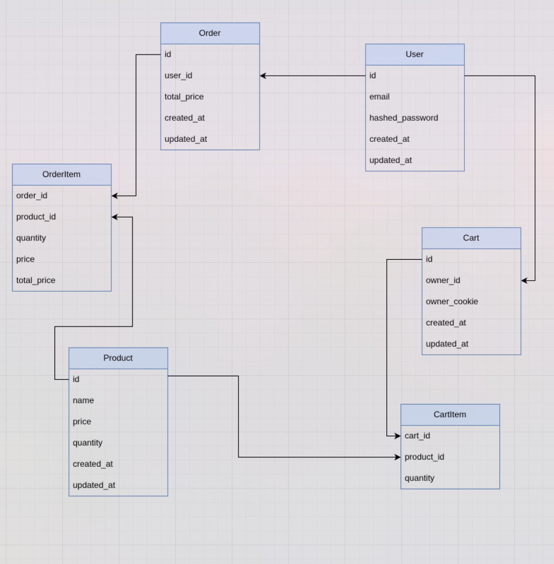

# TEST TASK FOR KEYMAKR

## Getting started

- install [uv](https://docs.astral.sh/uv/getting-started/installation/)
- install [task runner](https://taskfile.dev/)
- Initialize the project

```bash
  task init
```

## DB Migrations


to apply all migrations:

```bash
  task run-migrations
```

## TO RUN PROJECT

```bash
  task run-app
```


## LINK TO API ENDPOINTS

http://0.0.0.0:8007/


## DB Schema

